# Splunk SIEM Home Lab – Attack Simulation & Detection

This project shows how I set up a small security lab, ran real attacks on Metasploitable3, forwarded logs to Splunk, and built detections, dashboards, and alerts.

**Created by:** Nwodu Robert  
GitHub: @Robertnile  
Location: Port Harcourt, Nigeria  

**Tools used**  
- Victim: Metasploitable3 (Ubuntu)  
- Attacker: Kali Linux  
- Network Monitoring: Zeek  
- SIEM: Splunk Enterprise + Universal Forwarder  

**Note:** All IP addresses (192.168.122.x), credentials, and hostnames are from an isolated lab environment. No real systems or data were used.

## 1. Lab Network Diagram
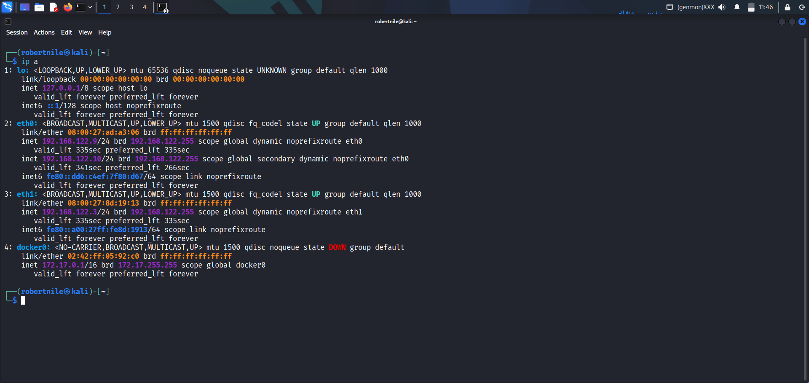  
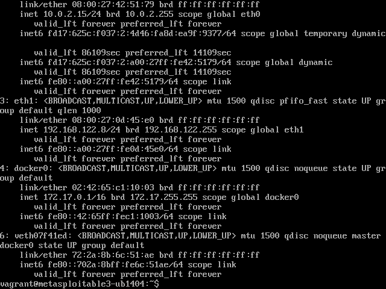

(More topology images in the screenshots folder)

## 2. Setting Up Splunk & Forwarding Logs
  
  
  
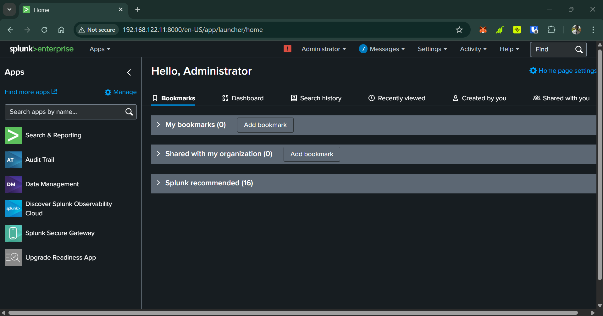  
  
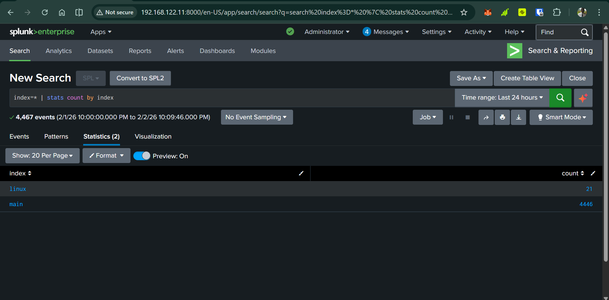  
  
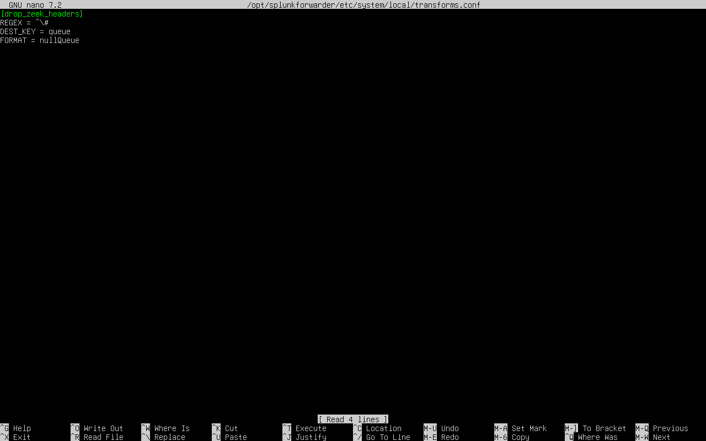  

## 3. Normal Traffic (Baseline)
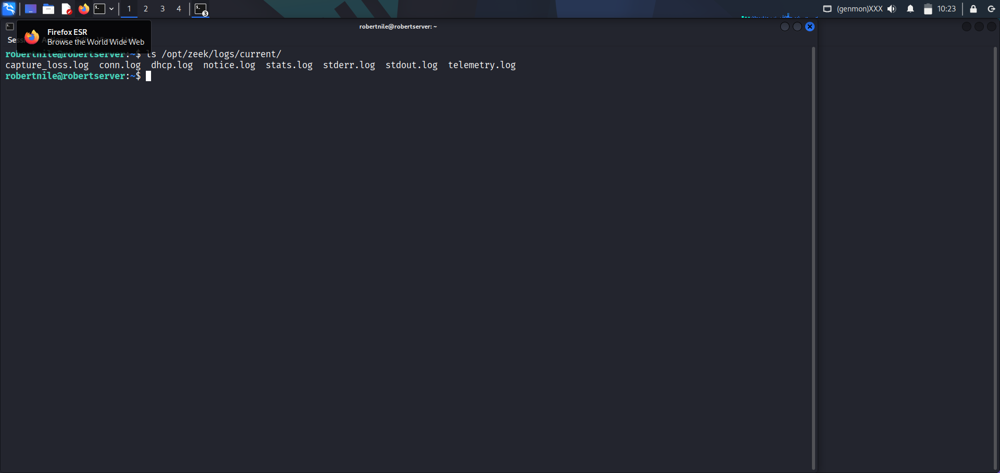  
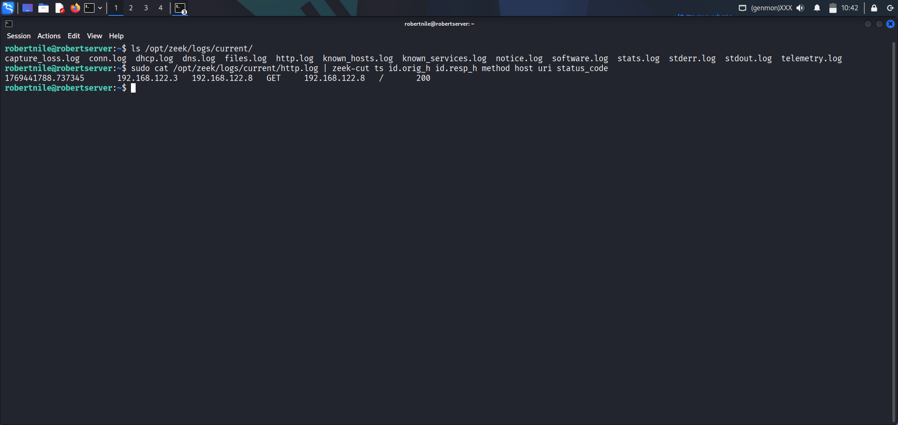  
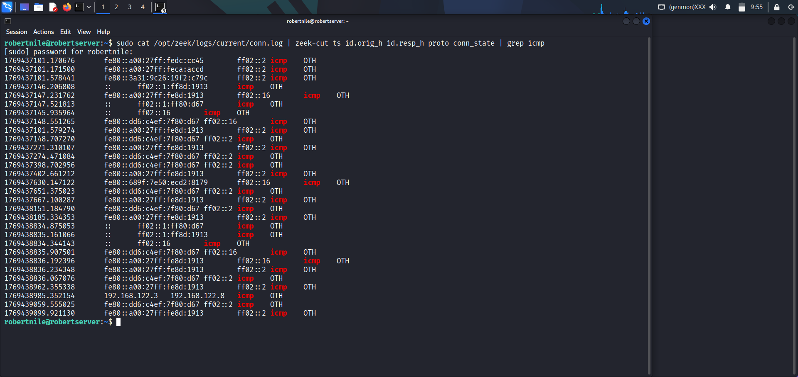

## 4. Attacks Performed

**Nmap Scan**  
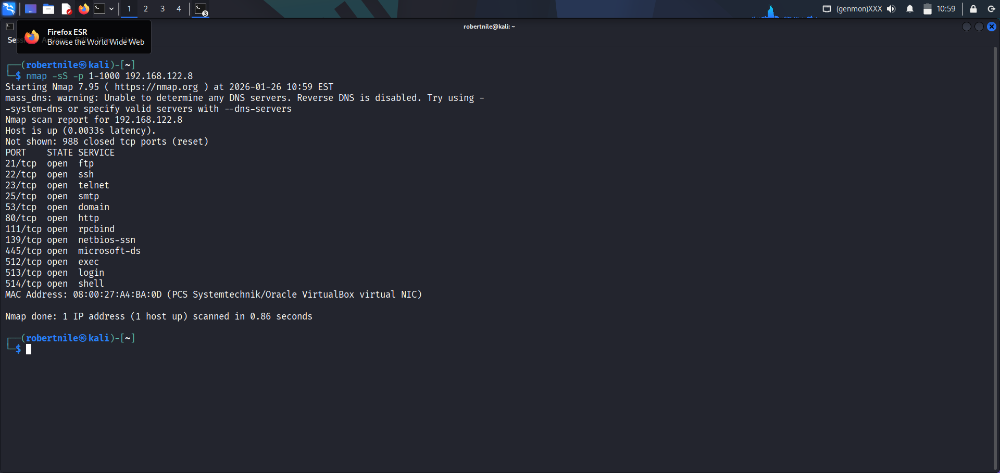  
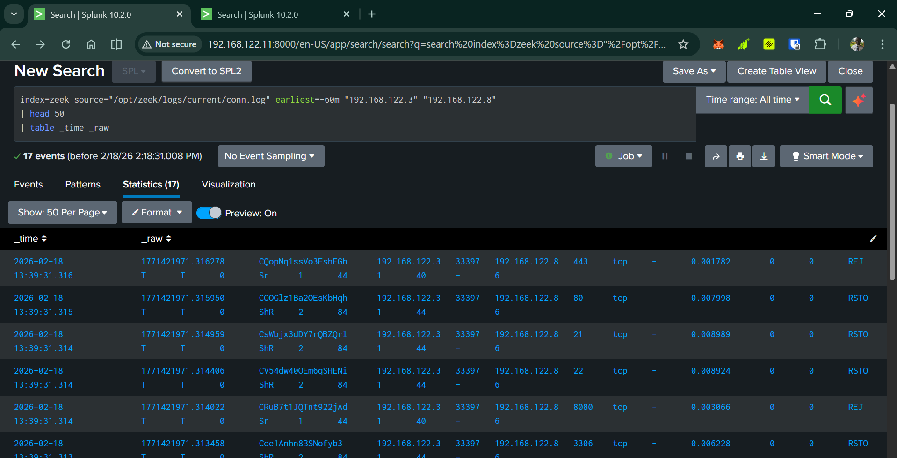

**SSH Brute Force**  
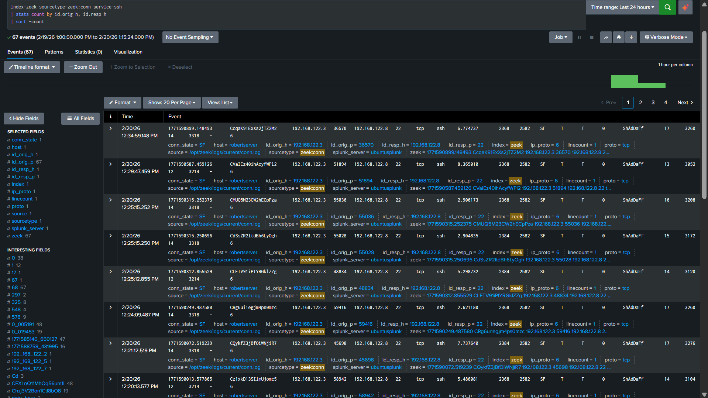  
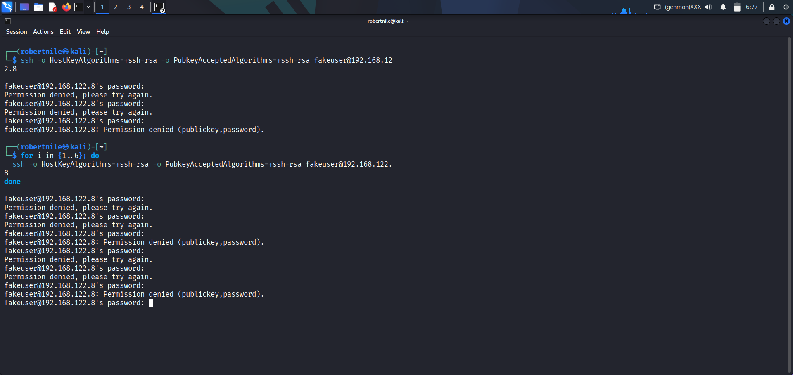  
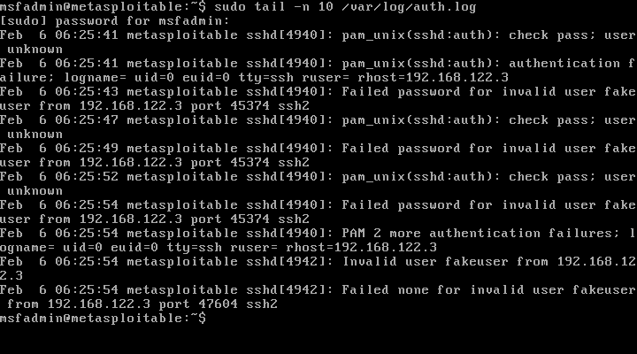  
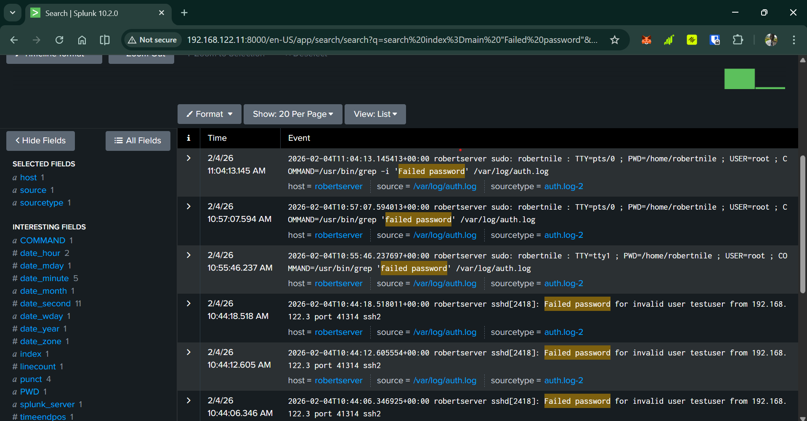

## 5. Detections & Alerts

**Linux Account & Privilege Monitoring Dashboard**  

**Useradd / Privilege Abuse Detection**  
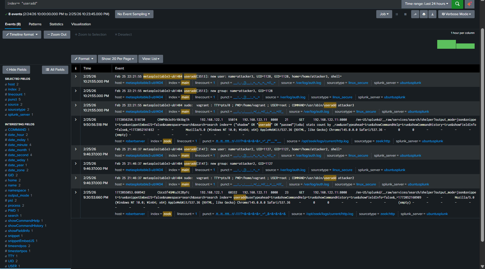

**SSH Brute Force Alert**  
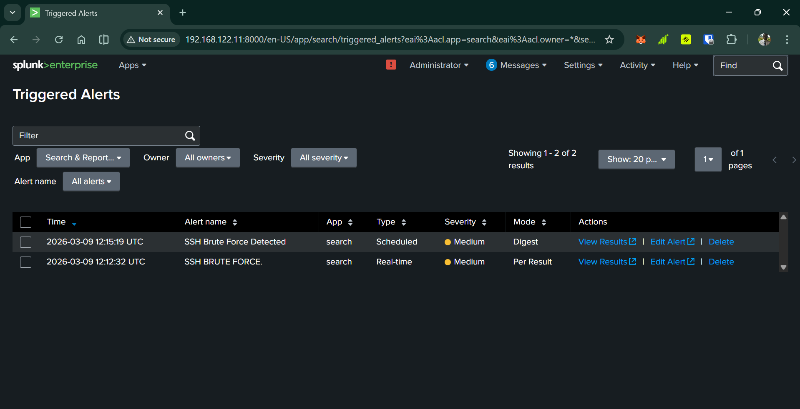

**Zeek Reverse Shell Detection**  
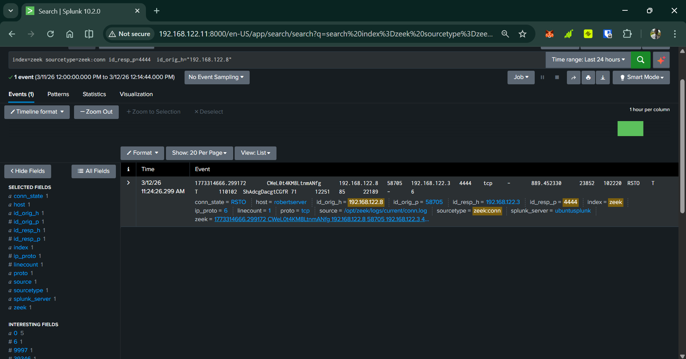

**Nmap Scan Detection in Zeek**  
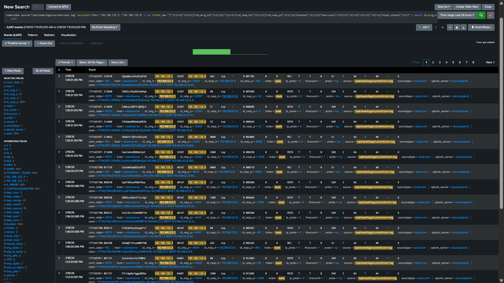

## All Screenshots
See every screenshot from the project here:  
→ [screenshots folder](screenshots/)

Thanks for checking out my lab!
