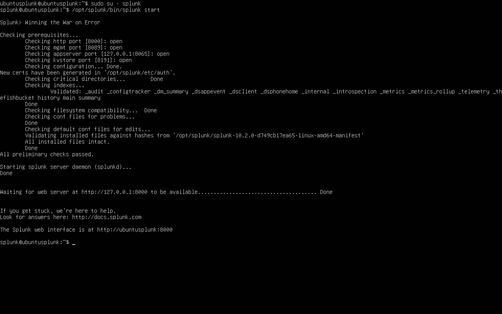
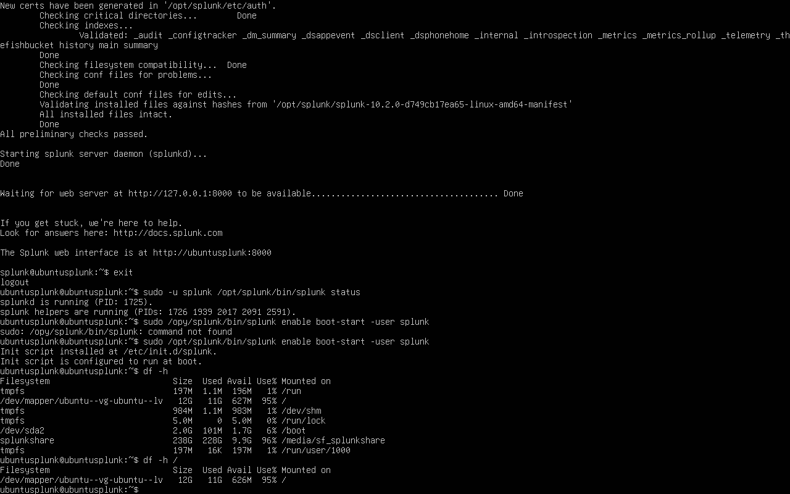
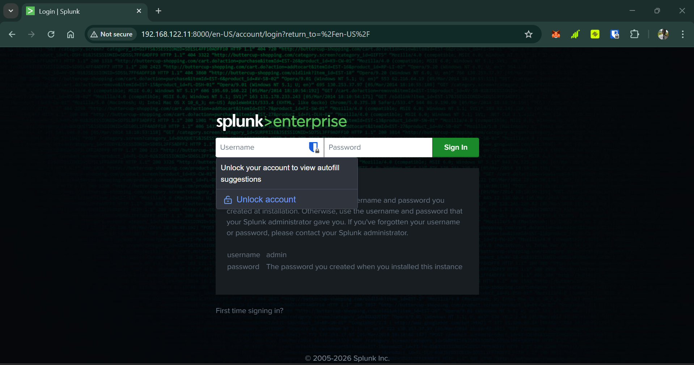
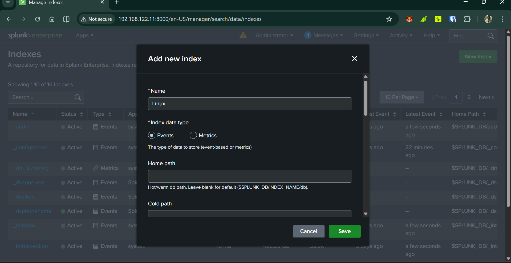
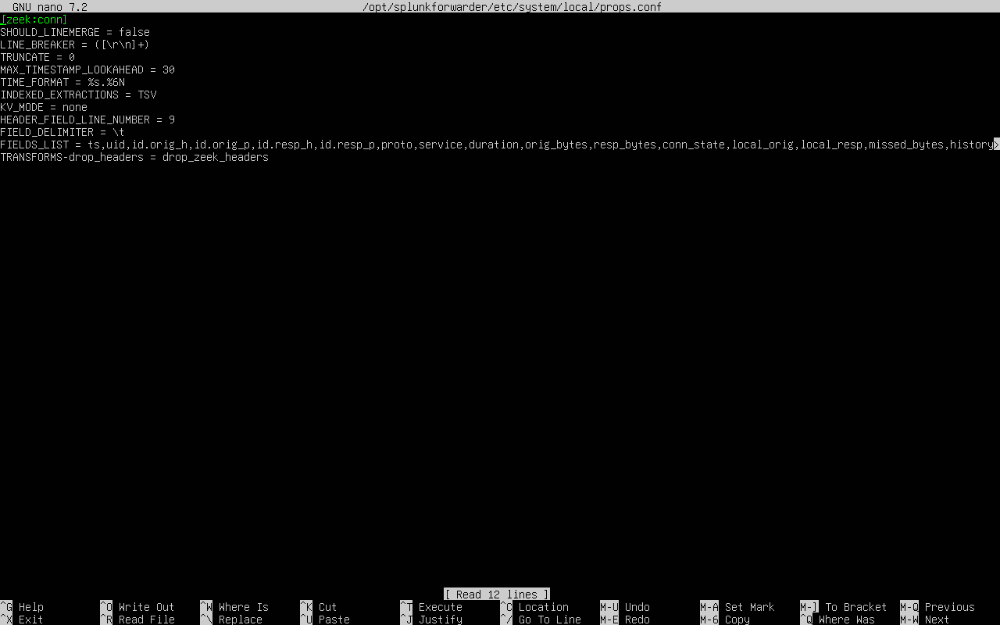
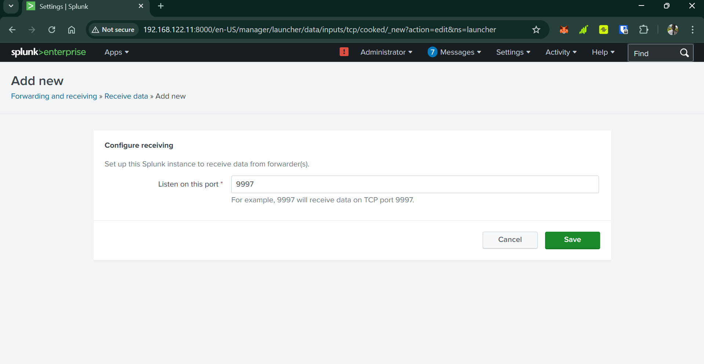
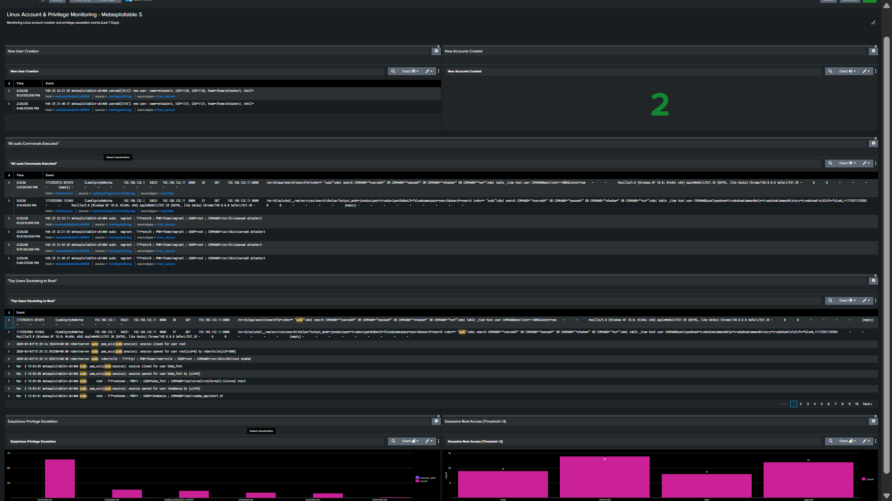

# Splunk SIEM Home Lab – Attack Simulation & Detection

This project shows how I set up a small security lab, ran real attacks on Metasploitable3, forwarded logs to Splunk, and built detections, dashboards, and alerts.

**Created by:** Nwodu Robert  
Aspiring SOC Analyst | Currently training at Luke Tech Limited, Canada
GitHub: @Robertnile  
Location: Nigeria  

**Tools used**  
- Victim: Metasploitable3 (Ubuntu)  
- Attacker: Kali Linux  
- Network Monitoring: Zeek  
- SIEM: Splunk Enterprise + Universal Forwarder  

**Note:** All IPs, credentials, and hostnames are from an isolated lab environment. No real systems or data were used.

## 1. Lab Network Diagram
  


(More topology images in the screenshots folder)

## 2. Setting Up Splunk & Forwarding Logs
  
  
  
  
  
  
  
  


## 3. Normal Traffic (Baseline)
  
  


## 4. Attacks Performed

**Nmap Scan**  
  


**SSH Brute Force**  
  
  
  


## 5. Detections & Alerts

**Linux Account & Privilege Monitoring Dashboard**  


**Useradd / Privilege Abuse Detection**  


**SSH Brute Force Alert**  


**Zeek Reverse Shell Detection**  


**Nmap Scan Detection in Zeek**  


## All Screenshots
See every screenshot from the project here:  
→ [screenshots folder](screenshots/)

## Detection Queries

Here are some of the key SPL queries I used to detect the attacks in Splunk:

**SSH Brute Force Detection**  
```spl
index=main sourcetype=linux_secure "Failed password" OR "authentication failure"
| stats count by src_ip user
| where count > 5
| sort -count
```
Triggers on high failed login attempts from the same IP/user.

**New User / Privilege Escalation Detection** 
```
index=main sourcetype=linux_secure ("new user" OR "new group" OR "COMMAND=*useradd*" OR "COMMAND=*usermod*")
| table _time host user _raw
| sort -_time
```
Detects suspicious account creation or modification via sudo

**Reverse Shell / C2 Traffic Detection (Zeek)**
```
index=zeek sourcetype=zeek:conn id_orig_h=192.168.122.8 id_resp_p=4444
| table _time id_orig_h id_orig_p id_resp_h id_resp_p proto service duration orig_bytes resp_bytes conn_state
| where duration > 10 OR orig_bytes > 1000
```
Identifies long-lived outbound TCP connections to non-standard ports (e.g., Meterpreter beaconing).

**Nmap Scan Detection (Zeek)**
```
index=zeek sourcetype=zeek:conn id_orig_h=192.168.122.3
| stats count values(id_resp_p) as scanned_ports by id_orig_h id_resp_h
| where count > 20
| sort -count
```
Flags IPs scanning many ports (typical nmap behavior)

## MITRE ATT&CK Mapping
|Attack Simulated        |Tactic                  | Technique ID                                               
|------------------------|------------------------|-----------------------------------------------------------------
|   Nmap Scan            |Reconnaissance          |[T1046](https://attack.mitre.org/techniques/T1046/) 
| SSH Brute Force        | Credential Access      | [T1110.001](https://attack.mitre.org/techniques/T1110/001/)
| New User Creation      | Persistence            | [T1136.001](https://attack.mitre.org/techniques/T1136/001/) 
| Sudo Privilege Abuse   | Privilege Escalation   | [T1548.003](https://attack.mitre.org/techniques/T1548/003/)    
| Drupal RCE             | Initial Access         | [T1190](https://attack.mitre.org/techniques/T1190/)  
| Reverse Shell          | Command & Control      | [T1571](https://attack.mitre.org/techniques/T1571/) 

## Log Flow Architecture
1. Kali Linux performs attacks against Metasploitable3
2. Metasploitable logs (auth.log, system logs) are forwarded using Splunk Universal Forwarder
3. Zeek monitors network traffic and generates network logs
4. Zeek logs are also forwarded to Splunk
5. Splunk indexes logs and allows detection queries, dashboards, and alerts

## Skills Demonstrated
- SIEM deployment and configuration (Splunk)
- Log ingestion and parsing
- Network monitoring with Zeek
- Attack simulation and adversary emulation
- Detection engineering
- Alert creation
- Security monitoring dashboards
- Linux log analysis

## Lessons Learned
- Log forwarding is critical — configuring Universal Forwarder and receiving port correctly took time, but was essential for real-time detection.
- Zeek conn.log is powerful for network-based detections (scans, brute-force, reverse shells), but needs correct props/transforms.conf parsing in Splunk.
- Small filename mismatches (space vs hyphen) can break Markdown image links — always double-check exact names.
- Privilege escalation (sudo useradd) is very visible in auth.log — easy to detect with simple searches and alerts.
- Simulated attacks help understand attacker mindset and how to build better detections.
- Patience is key in cybersecurity work.  
  When things feel messy or broken (e.g., log parsing failing, log ingestion issues, configurations failed), stepping back, researching, and trying one small fix at a time often leads to breakthroughs. This project taught me that persistence and systematic troubleshooting are more important than rushing to the next step.

Thanks for checking out my lab! Feedback and suggestions are welcome.

